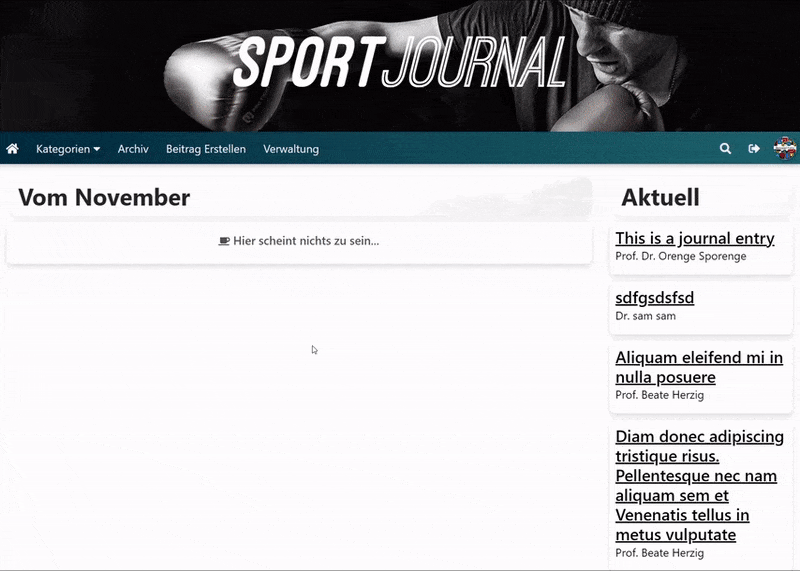
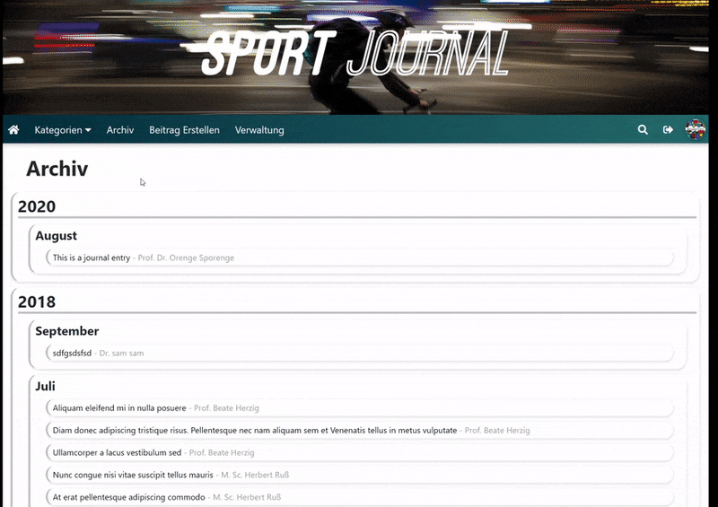
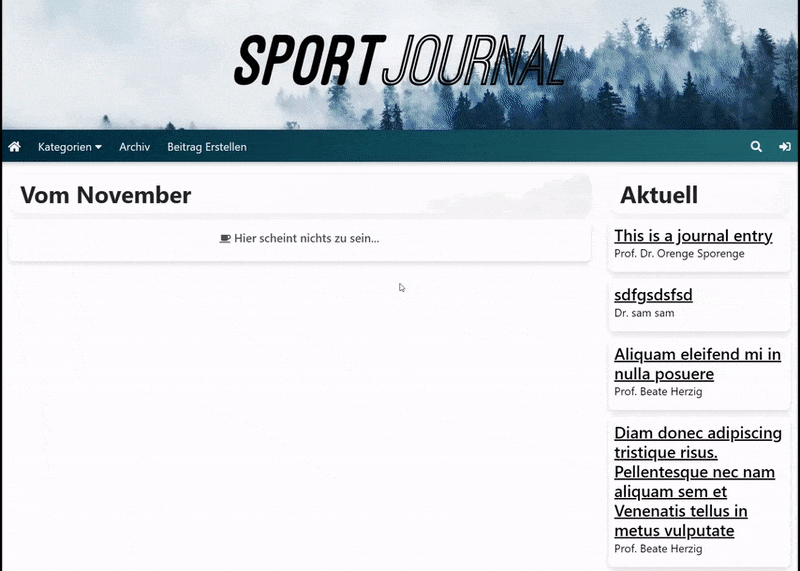
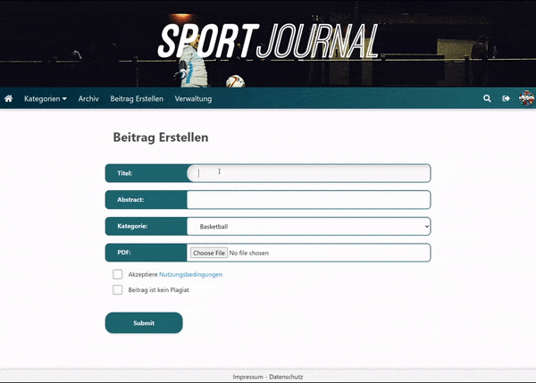

# Features:

## Hauptseite mit Feed:

## Archiv Ansicht:

## Login/Registrierung:

## Beitrag Erstellen:

## Nutzer Konto und Admin Verwaltung:

# Setup
Mit XAMPP:

1. httpd.conf ------------------------------------------------------------------------------------------
 - DocumentRoot Muss in ".../src/" sein
 - Directory direct unter DocumentRoot muss auch ".../src/" sein
 - in \<IfModule mime_module\> muss noch "AddType application/x-httpd-php .php .html" hinzugefügt werden

2. php.ini ---------------------------------------------------------------------------------------------
 - file_uploads=On
 - Benötigte Extensions:
	extension=mysqli
	extension=pdo_mysql
	extension=pdo_sqlite
	extension=php_sqlite3.dll
	extension=php_pdo_sqlite.dll
	extension=php_pdo_mysql.dll
	extension=php_soap.dll

3. Bedienung -------------------------------------------------------------------------------------------
 - Admin daten:
	Nutzername: admin
	Kennwort: password

 - Um die Datenbank neu zu generieren und alle in der DB gespeicherten Dateien zu löschen (Profilfotos, Beiträge, usw.): "/php/generateDB.php" aufrufen
 - Falls der Admin gelöscht wurde oder im Fall, dass es kein Admin gibt: "/php/createAdmin.php" aufrufen
